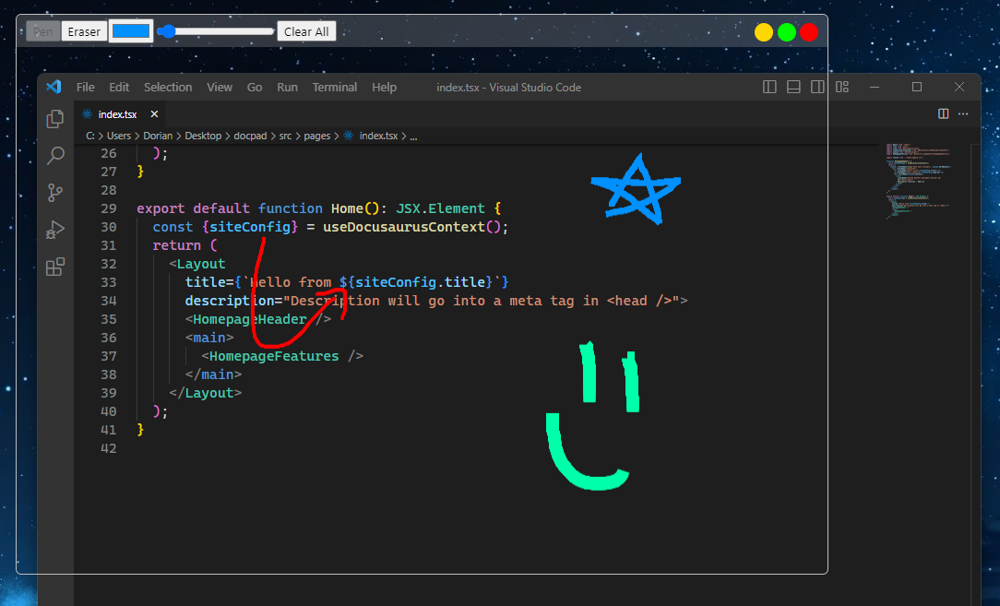

# Winboard 

Winboard allows to draw on top of other applications

## Downloads
- [Download v0.3.0 Windows x64 installer](https://github.com/doriandres/winboard/releases/download/v0.3.0/Winboard-windows-x64-0.3.0.zip)
- [Download v0.3.0 Mac OS x64 installer](https://github.com/doriandres/winboard/releases/download/v0.3.0/Winboard-mac-x64-0.3.0.zip)

## Usage Example

## Uninstalling
To uninstall you can remove the following folder from your system
`C:\Users\<YOUR_USER>\AppData\Local\winboard`
